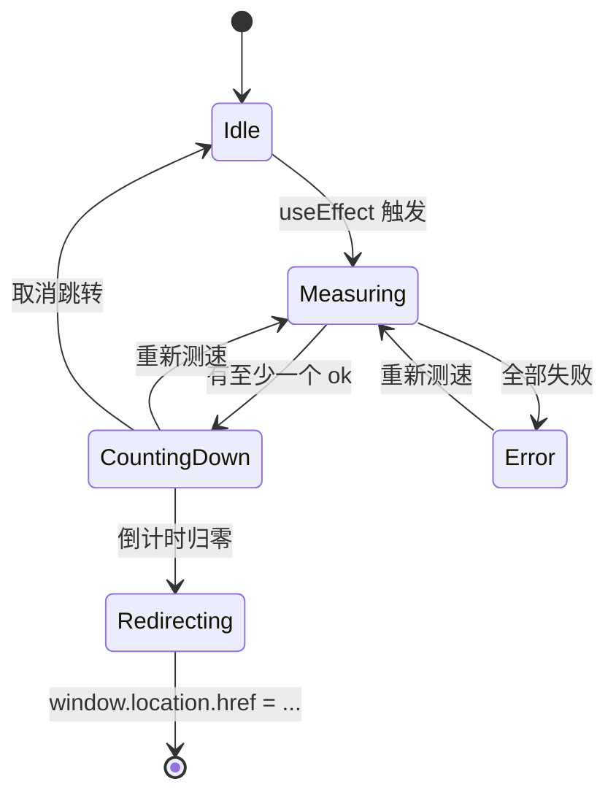

# BawMusic Router 技术架构

## 1. 技术栈

- **Next.js 16.2.4** + **React 19.2.4** + **TypeScript 5**（与 BawMusic / BawTV 完全一致）
- `output: 'export'` 纯静态导出，产物在 `out/`
- 原生 CSS（CSS Variables + 玻璃质感 + 系统字体）
- 零运行时依赖（除 React）

## 2. 路由

| 路径 | 说明 |
| ---- | ---- |
| `/` | 唯一页面：测速 + 选路 + 跳转 |
| `/_not-found` | 404 兜底（Next 默认） |

## 3. 目录结构

```
/workspace/MusicLanddingPage/
├── .trae/documents/{PRD.md, Technical-Architecture.md}
├── app/
│   ├── layout.tsx
│   ├── page.tsx           # 主页面（测速 + 跳转）
│   ├── globals.css
│   └── icon.svg
├── components/
│   ├── TargetCard.tsx     # 单个目标节点卡片（ping 状态、延迟、徽标）
│   ├── CountdownBar.tsx   # 倒计时 + 取消/重测按钮
│   └── ManualLinks.tsx    # 手动兜底链接
├── lib/
│   └── ping.ts            # ping 逻辑（fetch + performance.now + timeout）
├── types/
│   └── route.ts
├── package.json
├── tsconfig.json
├── next.config.ts
├── .gitignore
├── .prettierrc.json
├── .prettierignore
├── .nvmrc
└── README.md
```

## 4. 核心模块

### 4.1 `lib/ping.ts`

```ts
type PingResult = {
  url: string;
  ok: boolean;
  latencyMs: number | null;  // null 表示超时 / 失败
  error?: string;
};

// 主入口：测速单个目标
export async function pingUrl(
  url: string,
  options?: { timeoutMs?: number }
): Promise<PingResult>;

// 主入口：测速多个目标
export async function pingAll(
  urls: string[],
  options?: { timeoutMs?: number; rounds?: number }
): Promise<PingResult[]>;
```

**测速策略**：
- `fetch(url + '/?_r=' + Date.now(), { mode: 'no-cors', cache: 'no-store' })`
- 用 `AbortController` 实现超时（默认 2000ms）
- 同一目标打 2 次（间隔 200ms），取最小延迟，过滤 timeout
- `no-cors` 模式返回 opaque response，但 `performance.now()` 的差值仍是真实网络耗时

### 4.2 状态机



### 4.3 路径透传

```ts
const path = window.location.pathname + window.location.search + window.location.hash;
const target = `${fastestUrl}${path}`;
window.location.href = target;
```

## 5. 部署

- `npm run build` 产出 `out/`
- 部署到任意静态托管：
  - GitHub Pages：push 到 `gh-pages` 分支
  - Vercel / Netlify / CloudFlare Pages：直连 git，自动 build
  - 阿里云 ESA：同 BawMusic 的 `esa.jsonc` 模式（assets.directory = "./out"）
- 入口域建议：`www.bawmusic.top` 或 `router.bawmusic.top` 或裸 `bawmusic.top`（替换原 BawMusic 入口）

## 6. 性能与安全

- `no-cors` 测速：不会发送 cookie / 凭据到目标域
- 不写 localStorage / cookie：完全无状态
- 不引入第三方分析 / 字体 CDN / 图片 CDN：完全自包含
- HTML 体积 < 5KB（无图片、无字体），JS 体积 < 20KB gzipped
- DNS 预解析：测速完成后向 `fastest` 域插入 `<link rel="preconnect" crossorigin>`

## 7. 与 BawMusic / BawTV 的关系

- 完全独立项目，部署在独立子域
- 不调用 BawMusic / BawTV 的任何接口
- 仅复用三方的设计语言（纯黑 + 玻璃 + 系统字体 + 圆角）
